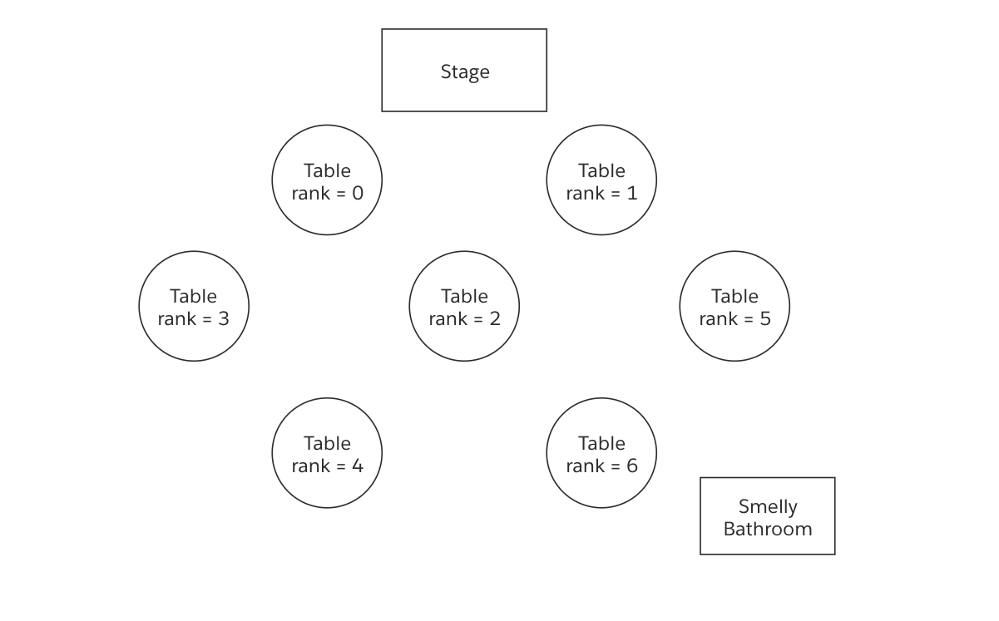

# The Challenge

We hope you’ll agree we’ve designed this coding exercise to be a bit of lighthearted fun around everybody’s favorite party planning activity: seating charts. Rest assured, nothing in this test depends on clever esoteric algorithms; your favorite trusted JSON parser along with arrays, hash tables/dictionaries, and some elbow grease is all you really need. And some patience with those extended parts of the family that just can’t figure out how to be civilized when seated next to each other 🙄.

**Note: the order in which you print out each statement does not matter, as long as the statements match the acceptable solution. In some case, a question has multiple valid solutions.**

Feel free to read the requirements of all the parts before starting, but please tackle one part at a time.

All the examples below are also provided as json files in the `examples` directory.

## Part 1: Give Everyone a Seat

A wedding planning company has reached out to you. They want you to create seating charts for them based on the list of parties that have RSVP’d and available tables. They say they don’t care how everybody is seated they just want to make sure everybody has a seat. They gave the following requirements:

### 1a: Whenever you seat a person print out “{{Party Name}} at {{Table Name}}”.

Example Data: `examples/part_1a_example_1.json`

```json
{
  "parties": [
    {
      "partyName": "Rodriguez",
      "count": 2
    },
    {
      "partyName": "Smith",
      "count": 2
    }
  ],
  "tables": [
    {
      "tableName": "Table 1",
      "numberOfSeats": 6
    }
  ]
}
```

Acceptable Solution

```
Rodriguez at Table 1
Rodriguez at Table 1
Smith at Table 1
Smith at Table 1
```

Example Data: `examples/part_1a_example_2.json`

```json
{
  "parties": [
    {
      "partyName": "Patel",
      "count": 2
    }
  ],
  "tables": [
    {
      "tableName": "Table 1",
      "numberOfSeats": 1
    },
    {
      "tableName": "Table 2",
      "numberOfSeats": 1
    }
  ]
}
```

Acceptable Solution

```
Patel at Table 1
Patel at Table 2
```

### 1B: If there aren’t enough seats, you should only print out “We do not have enough seats!”

Example Data: `examples/part_1b.json`

```json
{
  "parties": [
    {
      "partyName": "Lee",
      "count": 5
    }
  ],
  "tables": [
    {
      "tableName": "Table 1",
      "numberOfSeats": 4
    }
  ]
}
```

Acceptable Solution

```
We do not have enough seats!
```

## Part 2: Table Seed, Split Up Parties

The wedding planning company has started getting a lot more business thanks to you! Now they’re getting requests to have certain parties at specific tables. They want you to revise your seating chart service to accommodate these requirements:

### 2A: The “table Seed” field denotes what table a party must be sat at.

Example Data: `examples/part_2a.json`

```json
{
  "parties": [
    {
      "partyName": "Abara",
      "count": 2,
      "tableSeed": "Table 2"
    }
  ],
  "tables": [
    {
      "tableName": "Table 1",
      "numberOfSeats": 4
    },
    {
      "tableName": "Table 2",
      "numberOfSeats": 4
    }
  ]
}
```

Acceptable Solution

```
Abara at Table 2
Abara at Table 2
```

### 2B: If too many people are seeded to a table you should print out “{{Table Name}} does not have enough seats!”

Example Data: `examples/part_2b.json`

```json
{
  "parties": [
    {
      "partyName": "Rodriguez",
      "count": 4,
      "tableSeed": "Table 2"
    },
    {
      "partyName": "Smith",
      "count": 4,
      "tableSeed": "Table 2"
    }
  ],
  "tables": [
    {
      "tableName": "Table 1",
      "numberOfSeats": 6
    },
    {
      "tableName": "Table 2",
      "numberOfSeats": 6
    }
  ]
}
```

Acceptable Solution

```
Table 2 does not have enough seats!
```

### 2C: Split up parties that are not seeded

Example Data: `examples/part_2c.json`

```json
{
  "parties": [
    {
      "partyName": "Patel",
      "count": 4,
      "tableSeed": "Table 2"
    },
    {
      "partyName": "Lee",
      "count": 4,
      "tableSeed": null
    }
  ],
  "tables": [
    {
      "tableName": "Table 1",
      "numberOfSeats": 3
    },
    {
      "tableName": "Table 2",
      "numberOfSeats": 5
    }
  ]
}
```

Acceptable Solution:

```
Patel at Table 2
Patel at Table 2
Patel at Table 2
Patel at Table 2
Lee at Table 1
Lee at Table 1
Lee at Table 1
Lee at Table 2
```

## Part 3: Priorities

The wedding company has noticed they are spending a lot of time manually fixing the seating charts because their clients want family and friends to sit closer to the front and acquaintances towards the back. To help, we asked the clients to give priorities to parties and to rank the tables. Fill up the tables in the order of their rank so that the most important people sit at the most important tables. Rank or priority 0 is most important. Parties can have the same priority, but tables must have unique ranks.

Here’s an example table arrangement where the bride assigned the tables rankings.



The bride wants the Family to be seated closer to the stage so all parties that are part of the family are assigned priority 0. Friends get the next-best seats so they are assigned priority 1. Acquaintances with priority 2 are given the leftover seats. In this problem, tables are filled up one-by-one till in the order of their rank until they are full

### 3A: Priorities on tables and Parties

Example Data: `examples/part_3a.json`

```json
{
  "parties": [
    {
      "partyName": "Smith",
      "count": 2,
      "priority": 0
    },
    {
      "partyName": "Rodriguez",
      "count": 2,
      "priority": 1
    },
    {
      "partyName": "Patel",
      "count": 2,
      "priority": 2
    }
  ],
  "tables": [
    {
      "tableName": "Table 1",
      "numberOfSeats": 4,
      "rank": 1
    },
    {
      "tableName": "Table 2",
      "numberOfSeats": 4,
      "rank": 0
    }
  ]
}
```

Acceptable Solution

```
Smith at Table 2
Smith at Table 2
Rodriguez at Table 2
Rodriguez at Table 2
Patel at Table 1
Patel at Table 1
```

### 3B: Parties can have the same priority

Example Data: `examples/part_3b.json`

```json
{
  "parties": [
    {
      "partyName": "Lee",
      "count": 2,
      "priority": 0
    },
    {
      "partyName": "Abara",
      "count": 2,
      "priority": 0
    },
    {
      "partyName": "Smith",
      "count": 2,
      "priority": 1
    }
  ],
  "tables": [
    {
      "tableName": "Table 1",
      "numberOfSeats": 2,
      "rank": 0
    },
    {
      "tableName": "Table 2",
      "numberOfSeats": 2,
      "rank": 1
    },
    {
      "tableName": "Table 3",
      "numberOfSeats": 2,
      "rank": 2
    }
  ]
}
```

Acceptable Solutions

```
Lee at Table 1
Lee at Table 1
Abara at Table 2
Abara at Table 2
Smith at Table 3
Smith at Table 3
```

```
Lee at Table 2
Lee at Table 2
Abara at Table 1
Abara at Table 1
Smith at Table 3
Smith at Table 3
```

### 3C: Priority and Seeds work together

Parties will either have seeds or priorities, not both. Honor table seeds first, then priority seating.

Example Data: `examples/part_3c.json`

```json
{
  "parties": [
    {
      "partyName": "Rodriguez",
      "count": 2,
      "priority": 0
    },
    {
      "partyName": "Patel",
      "count": 2,
      "priority": 1
    },
    {
      "partyName": "Lee",
      "count": 2,
      "priority": 2
    },
    {
      "partyName": "Abara",
      "count": 2,
      "tableSeed": "Table 2"
    }
  ],
  "tables": [
    {
      "tableName": "Table 1",
      "numberOfSeats": 3,
      "rank": 2
    },
    {
      "tableName": "Table 2",
      "numberOfSeats": 3,
      "rank": 1
    },
    {
      "tableName": "Table 3",
      "numberOfSeats": 3,
      "rank": 0
    }
  ]
}
```

Acceptable solution

```
Abara at Table 2
Abara at Table 2
Rodriguez at Table 3
Rodriguez at Table 3
Patel at Table 3
Patel at Table 2
Lee at Table 1
Lee at Table 1
```

## Part 4: Blacklist

Business is booming and bells are ringing! This wedding planning company has taken on so many customers that it’s starting to plan weddings where some of the parties need to be kept far apart. They need your help making seating charts that keep bickering parties at separate tables. Here’s what they’ve given:

### 4A: The “blacklist” field denotes what fellow parties should be at separate tables.

Example Data: `examples/part_4a.json`

```
{
"parties" : [

  {
    "id": 2,
    "partyName": "Smith",
    "count": 3,
    "tableSeed": "Table 1",
    "priority": 0,
    "blacklist": []
  },
  {
    "id": 3,
    "partyName": "Rodriguez",
    "count": 6,
    "tableSeed": null,
    "priority": 1,
    "blacklist": [2]
  }
],
"tables" : [
  {
    "tableName": "Table 1",
    "numberOfSeats": 10,
    "rank": 0
  },
  {
    "tableName": "Table 2",
    "numberOfSeats": 10,
    "rank": 0
  }
  ]
}
```

Acceptable Solution

```
Smith at Table 1
Smith at Table 1
Smith at Table 1
Rodriguez at Table 2
Rodriguez at Table 2
Rodriguez at Table 2
Rodriguez at Table 2
Rodriguez at Table 2
Rodriguez at Table 2
```

### 4B: If you cannot keep two parties split up, you should print out “I cannot separate {{Party Name}} and {{Party Name}}!”

Example Data: `examples/part_4b.json`

```json
{
  "parties": [
    {
      "id": 2,
      "partyName": "Patel",
      "count": 3,
      "tableSeed": null,
      "priority": 0,
      "blacklist": []
    },
    {
      "id": 3,
      "partyName": "Lee",
      "count": 6,
      "tableSeed": null,
      "priority": 1,
      "blacklist": [2]
    }
  ],
  "tables": [
    {
      "tableName": "Table 1",
      "numberOfSeats": 10,
      "rank": 0
    }
  ]
}
```

Acceptable Solution

```
I cannot separate Patel and Lee!
```
